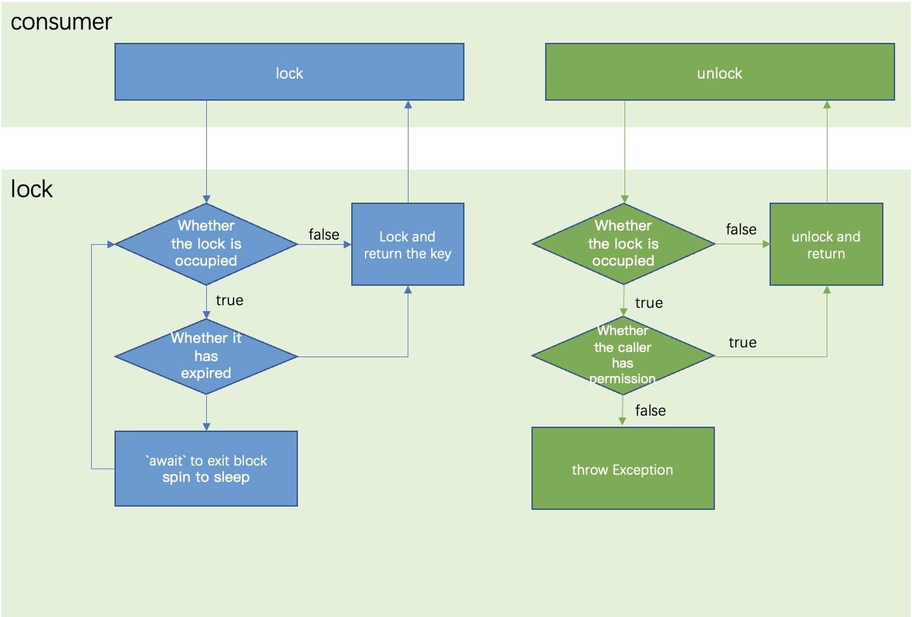

#

## Problem
Typically, the Internet Computer blockchain has a feature that 'One canister processes its messages one-at-a-time' and prevents race conditions so that the request is atomic. But when we use the "await" keyword, it will allow other requests to enter, which will destroy atomicity.

``` rust
actor Next {
    private var num: Nat = 0;
    public shared func nextId(): async Nat {
        num := await Comp.add(num);
        num
    };
}
actor Comp {
    public shared func add(n: Nat): async Nat {
        n + 1
    };
}
```
The code above shows a method to get nextId. In this method, each time the `nextId()` method is called, the Comp method is called to calculate the result, and then the result is stored and returned. In a sequential execution scenario, there is no problem, but in a concurrent scenario, the code of `await c.Com p.dd (num)` releases the current thread. Then the same ID will be generated.

``` shell
#!/bin/bash
function seq_get() {
    for i in {1..5};
    do
        dfx canister call Next nextId 
    done
}
# outputs
# (1 : nat)
# (2 : nat)
# (3 : nat)
# (4 : nat)
# (5 : nat)
function curr_get() {
    for i in {1..5};
    do
        dfx canister call Next nextId &
    done
}
# outputs 
# (6 : nat)
# (6 : nat)
# (6 : nat)
# (6 : nat)
# (6 : nat)
```

## Solution

We plan to use distributed locks to solve this problem.

Distributed locks have the following features:

- In a multi-canister environment, a lock can only be obtained by one request of a canister at a time
- Highly available "acquire-and-release" locks
- High-performance "acquire-and-release" locks
- With lock failure mechanism, including automatic unlocking and deadlock prevention
- with mechanism to prevent wrong unlocking
- With blocking feature, it automatically waits when the lock is not obtained, and automatically unlocks when the waiting time expires



``` rust
public shared func nextIdWithLock(): async Nat {
    var index = await lock.lock("id", 3000, 3000);
    num := await comp.add(num);
    await lock.unlock("id", index);
    num
}
```
``` shell
#!/bin/bash
function curr_get_with_lock() {
    for i in {1..5};
    do
    dfx canister call Next nextIdWithLock &
    done
}
# outputs
# (7 : nat)
# (10 : nat)
# (8 : nat)
# (9 : nat)
# (11 : nat)
```

### Prevent deadlock
Use the `expires` parameter to prevent deadlocks. After the expiration time expires, the lock will be allowed to be reacquired by another request.

### Set timeout

Use the `timeout` parameter to set the timeout time to acquire the lock. When the timeout time is reached and the lock is not acquired, '0' will be returned.

### Prevent wrong unlocking

The `lock()` method will return a return value of type 'Nat', which needs to be passed during "unlocking". If passed incorrectly, unlocking will fail.

